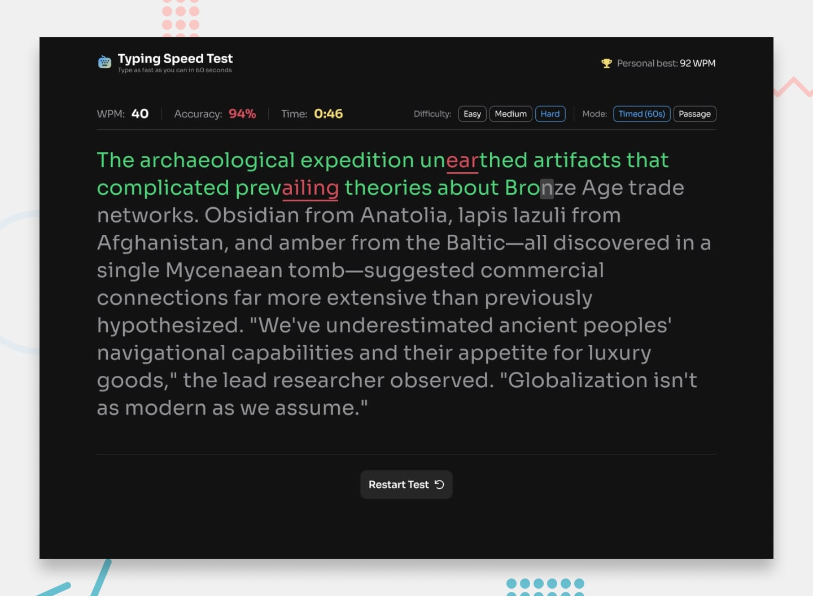

# Frontend Mentor - Typing Speed Test solution

This is my solution to the [Typing Speed Test challenge on Frontend Mentor](https://www.frontendmentor.io/challenges/typing-speed-test). The project is a full typing test app built in Nuxt with multiple modes, persistent score tracking, mobile-friendly controls, and a more expanded results experience.

## Table of contents

- [Overview](#overview)
  - [The challenge](#the-challenge)
  - [Bonus features](#bonus-features)
  - [Screenshot](#screenshot)
  - [Links](#links)
- [My process](#my-process)
  - [Built with](#built-with)
  - [What I learned](#what-i-learned)
  - [Continued development](#continued-development)
  - [Useful resources](#useful-resources)
  - [AI collaboration](#ai-collaboration)
- [Author](#author)

## Overview

### The challenge

Users should be able to:

- View the optimal layout for the interface depending on their device's screen size
- See hover and focus states for all interactive elements on the page
- Start a test by typing or by pressing a start button
- Switch between timed and passage modes
- Change difficulty, duration, and text category
- See live WPM, accuracy, and timer feedback while typing
- View a results screen with personal-best feedback and stored history

### Bonus features

Alongside the core challenge requirements, I also added a number of bonus features:

- Multiple timed test lengths: 15, 30, 60, and 120 seconds
- Extra text categories beyond standard passages, including quotes and code-style text
- Persistent test history stored locally
- A performance history chart on the results screen
- A keystroke heatmap showing which keys were used most and where errors happened
- Shareable downloadable result cards
- Personal-best tracking, including config-specific personal bests
- Celebration feedback with confetti for new high scores
- Multiple visual themes
- A focused layout mode for a narrower typing view

### Screenshot

### Links

- Solution URL: Frontend Mentor submission pending
- Live Site URL: Deployment pending

## My process

### Built with

- Nuxt 4
- Vue 3
- Pinia
- SCSS
- CSS custom properties with theme tokens
- Local storage for personal bests and test history
- Responsive layouts for desktop and mobile

### What I learned

This project was a good exercise in balancing design accuracy with real interaction complexity. The UI itself looks straightforward, but once the typing engine, scoring, persistence, responsive states, and mobile keyboard behavior were added, it became a much deeper build.

One of the most useful lessons was around mobile text input. Desktop keyboard handling can lean heavily on key events, but mobile virtual keyboards behave differently and can be inconsistent. The more reliable solution was to let the hidden textarea accept input naturally, inspect the resulting value, and then map that back into the typing state.

I also spent more time than usual on responsive interaction design instead of only responsive layout. On mobile, the controls needed to change from grouped desktop buttons into compact dropdown-based controls so the UI still felt intentional rather than just squeezed.

### Continued development

I would like to keep improving the analytics side of the app. The history view and heatmap are useful already, but there is room to make the insights clearer and more readable, especially on smaller screens.

I would also like to keep refining accessibility and keyboard behavior, particularly around input edge cases across different devices and browsers.

### Useful resources

- [Nuxt documentation](https://nuxt.com/docs) - Useful for structuring the app cleanly and keeping the project organized as features expanded.
- [Vue documentation](https://vuejs.org/guide/introduction.html) - Helpful for reactive UI state, component structure, and event handling.
- [MDN Web Docs](https://developer.mozilla.org/) - Useful for checking browser behavior around input events, focus handling, and responsive CSS.

### AI collaboration

I used GitHub Copilot during this project.

It was mainly used for generating the README itself and for creating extra test data so I had more passages available for additional typing tests.

## Author

- Jack
